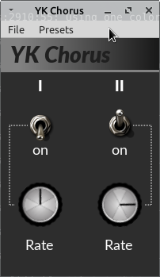

# YK Chorus

A chorus effect inspired by the one found in certain well-known Japanese
vintage analog synthesizers (**Y**ou **K**now which).

## Formats

This audio effect supports a variety of audio and plug-in frameworks:

* CLAP
* DSSI
* JACK (stand-alone program with GUI)
* LADSPA
* LV2
* VST2
* VST3

## Compiling

Make sure, you have installed the required build tools and libraries (see
section "Prerequisites" below) and then clone this repository (including
sub-modules) and simply run `make` in the project's root directory:

    $ git clone --recursive https://github.com/SpotlightKid/ykchorus.git
    $ cd ykchorus
    $ make

## Installation

To install all plugin formats to their appropriate system-wide location, run
the following command (root priviledges may be required):

    make install

The makefiles support the usual `PREFIX` and `DESTDIR` variables to change the
installation prefix and set an installation root directory (defaulty: empty).
`PREFIX` defaults to `/usr/local`, but on macOS and Windows it is not used,
since the system-wide installation directories for plugins are fixed.

Use make's `-n` option to see where the plugins would be installed without
actually installing them.

You can also set the installation directory for each plugin format with a
dedicated makefile variable.

* CLAP: `CLAP_DIR` (`<prefix>/lib/clap`)
* LADSPA: `LADSPA_DIR` (`<prefix>/lib/ladspa`)
* LV2: `LV2_DIR` (`<prefix>/lib/lv2`)
* VST2: `VST2_DIR` (`<prefix>/lib/vst`)
* VST3: `VST3_DIR` (`<prefix>/lib/vst3`)

Example: `make DESTDIR=/tmp/build-root VST_DIR=/usr/lib/lxvst install`

To install the plugins only for your current user account, run
`make install-user`.

Again, you can also set the installation directory for each plugin format with
a dedicated makefile variable.

* CLAP: `USER_CLAP_DIR` (`$HOME/.clap`)
* LADSPA: `USER_LADSPA_DIR` (`$HOME/.ladspa`)
* LV2: `USER_LV2_DIR` (`$HOME/.lv2`)
* VST2: `USER_VST2_DIR` (`$HOME/.vst`)
* VST3: `USER_VST3_DIR` (`$HOME/.vst3`)

*Note: The given default values for all of the above listed environment
variables differ depending on the target OS.*

## Prerequisites

* The GCC C++ compiler and the usual associated software build tools
  (`make`, etc.).

  Debian / Ubuntu users should install the `build-essential` package
  to get these.

* `patch`

* [pkgconf]

The [CLAP], [LV2], [LADSPA], [VST]2 (vestige) and VST3 headers are included in
the [DPF] framework, which is integrated as a Git sub-module. These need not be
installed separately to build the software in the respective plug-in formats.

Some formats do have additional dependencies, though:

* JACK client (stand-alone command line program): [JACK] development library
  and headers and pkgconf file.
* GUI (JACK, LV2, VST2): OpenGL development library and headers and pkgconf
  file (provided by the `libglvnd` or similar package on Linux). On Linux also
  X11 development library and headers and pkgconf file.

Optional (only needed for checking plugins after building them):

* [lv2lint]
* [KXStudio LV2 Extensions]

## License

This software is distributed under the GNU General Public License Version 2.

See the file `LICENSE` for more information.

## Author

This software project was put together by *Christopher Arndt*.

## Acknowledgements

Chorus DSP engine taken from the [TAL Noisemaker] software synthesizer by
Patrick Kunz, Togu Audio Line, Inc., released under the GPL-2.0.

Build using the DISTRHO Plugin Framework ([DPF]) and set up with the
[cookiecutter-dpf-effect] project template.

[Toggle switch] image by "az" from *Knob Gallery*, licensed under the
**Creative Commons CC-BY** license, [rotary knob] image by "geoghela",
published to the **CC0 Public Domain**.

[clap]: https://cleveraudio.org/
[cookiecutter-dpf-effect]: https://github.com/SpotlightKid/cookiecutter-dpf-effect
[dpf]: https://github.com/DISTRHO/DPF
[dssi]: http://dssi.sourceforge.net/
[jack]: http://jackaudio.org/
[kxstudio lv2 extensions]: https://github.com/KXStudio/LV2-Extensions
[ladspa]: http://www.ladspa.org/
[liblo]: http://liblo.sourceforge.net/
[lv2]: http://lv2plug.in/
[lv2lint]: https://open-music-kontrollers.ch/lv2/lv2lint/
[pkgconf]: https://github.com/pkgconf/pkgconf
[rotary knob]: https://www.g200kg.com/en/webknobman/gallery.php?m=p&p=1200
[tal noisemaker]: https://tal-software.com/products/tal-noisemaker
[toggle switch]: https://www.g200kg.com/en/webknobman/gallery.php?m=p&p=58
[vst]: https://en.wikipedia.org/wiki/Virtual_Studio_Technology

