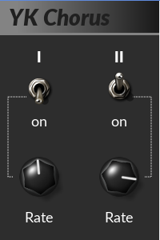

# YK Chorus

A chorus effect inspired by the one found in certain well-known Japanese
vintage analog synthesizers (**Y**ou **K**now which).

## Formats

This audio effect supports a variety of audio and plug-in frameworks:

* DSSI
* JACK (stand-alone command line program)
* LADSPA
* LV2
* VST2

## Compiling

Make sure, you have installed the required build tools and libraries (see
section "Prerequisites" below) and then clone this repository (including
sub-modules) and simply run `make` in the project's root directory:

    $ git clone --recursive https://github.com/SpotlightKid/ykchorus.git
    $ cd ykchorus
    $ make

## Installation

After compilation has finished, copy the desired plug-in shared libraries or
bundles or the stand-alone program to the appropriate locations.

The following command line examples assume you are using a Linux system:

    $ install -Dm755 bin/ykchorus -t ~/bin
    $ install -Dm755 bin/ykchorus-vst.so -t ~/.vst
    $ install -Dm755 bin/ykchorus-dssi.so -t ~/.dssi
    $ install -Dm755 bin/ykchorus-ladspa.so -t ~/.ladspa
    $ mkdir -p ~/.lv2; cp -a bin/ykchorus.lv2 ~/.lv2

The makefile provides the `install` target to execute the above commands in a
way that should work on different platforms, but this is not very well tested
at the moment.

There is also an `install-user` target, to install the binaries in the proper
lcoations under the current user's home directory.

    make -n install-user

shows you where the files would get installed, without actually doing so.

## Prerequisites

* The GCC C++ compiler and the usual associated software build tools
  (`make`, etc.).

  Debian / Ubuntu users should install the `build-essential` package
  to get these.

* [pkgconf]

The [DSSI], [LV2], [LADSPA] and [VST2] (vestige) headers are included in the
[DPF] framework, which is integrated as a Git sub-module. These need not be
installed separately to build the software in the respective plug-in formats.
Some formats do have additional dependencies, though:

* DSSI plug-in: and [liblo] development library and headers and pkgconf file.
* JACK client (stand-alone command line program): [JACK] development library
  and headers and pkgconf file.
* GUI (JACK, LV2, VST2): OpenGL development library and headers and pkgconf
  file (provided by the `mesa` package on Linux). On Linux also X11
  development library and headers and pkgconf file.

Optional (only needed for checking plugins after building them):

* [lv2lint]
* [KXStudio LV2 Extensions]

## License

This software is distributed under the GNU General Public License Version 2.

See the file `LICENSE` for more information.

## Author

This software project was put together by *Christopher Arndt*.

## Acknowledgements

Chorus DSP engine taken from the [TAL Noisemaker] software synthesizer by
Patrick Kunz, Togu Audio Line, Inc., released under the GPL-2.0.

Build using the DISTRHO Plugin Framework ([DPF]) and set up with the
[cookiecutter-dpf-effect] project template.

[Toggle switch] image by "az" from *Knob Gallery*, licensed under the
**Creative Commons CC-BY** license, [rotary knob] image by "geoghela",
published to the **CC0 Public Domain**.

[cookiecutter-dpf-effect]: https://github.com/SpotlightKid/cookiecutter-dpf-effect
[dpf]: https://github.com/DISTRHO/DPF
[dssi]: http://dssi.sourceforge.net/
[jack]: http://jackaudio.org/
[kxstudio lv2 extensions]: https://github.com/KXStudio/LV2-Extensions
[ladspa]: http://www.ladspa.org/
[liblo]: http://liblo.sourceforge.net/
[lv2]: http://lv2plug.in/
[lv2lint]: https://open-music-kontrollers.ch/lv2/lv2lint/
[pkgconf]: https://github.com/pkgconf/pkgconf
[rotary knob]: https://www.g200kg.com/en/webknobman/gallery.php?m=p&p=1200
[tal noisemaker]: https://tal-software.com/products/tal-noisemaker
[toggle switch]: https://www.g200kg.com/en/webknobman/gallery.php?m=p&p=58
[vst2]: https://en.wikipedia.org/wiki/Virtual_Studio_Technology
